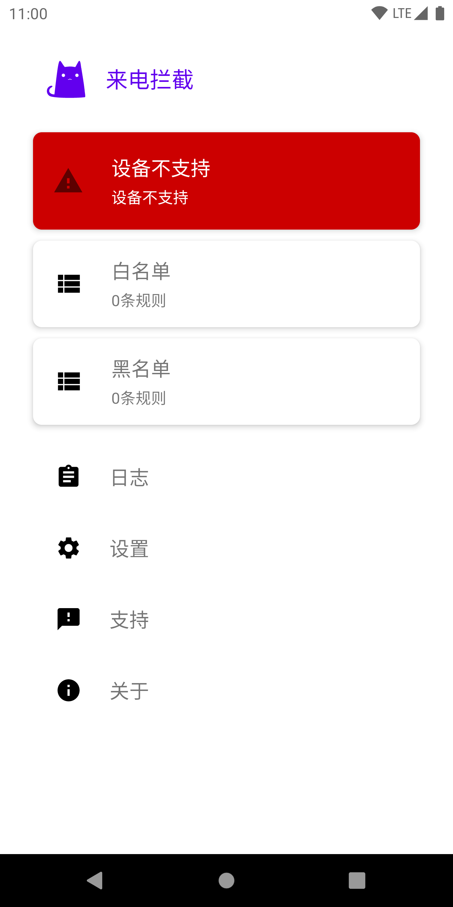
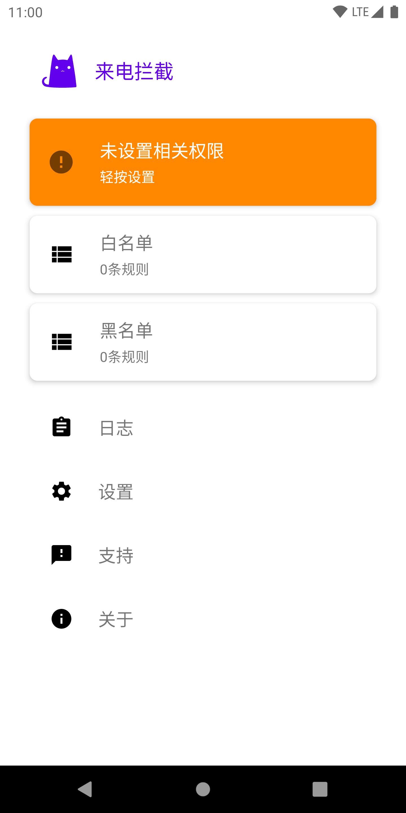
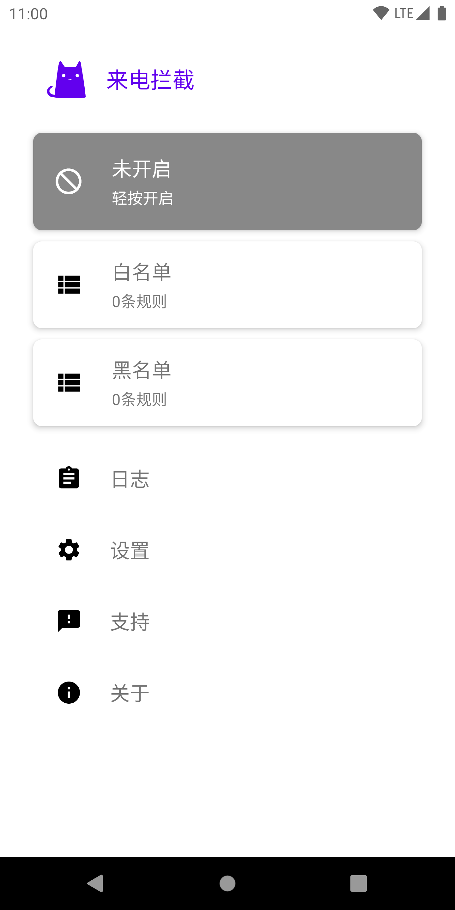
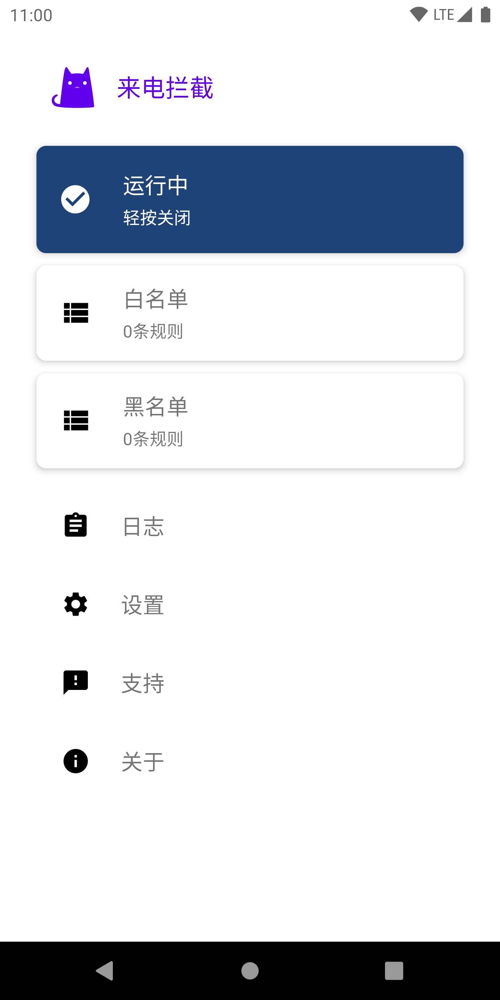
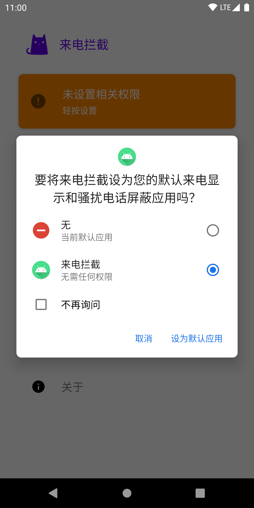
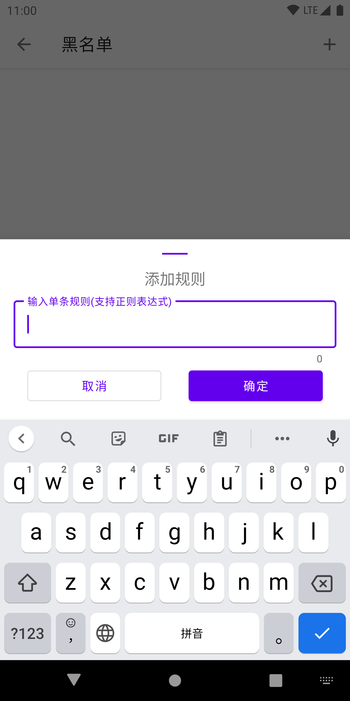
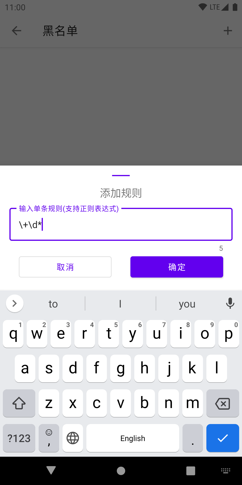
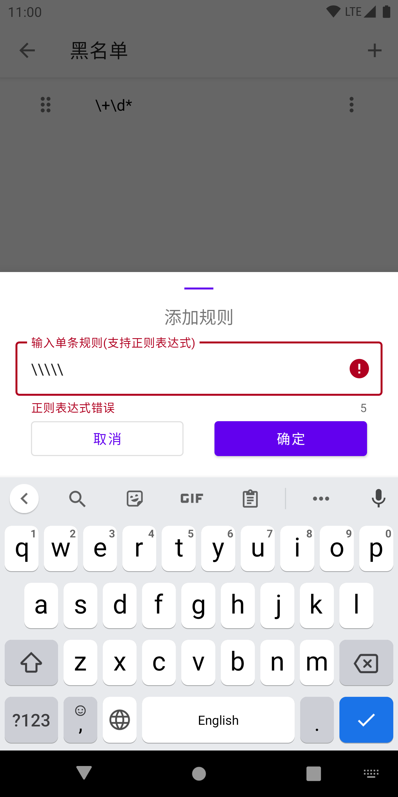
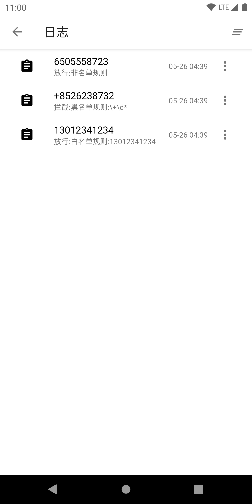
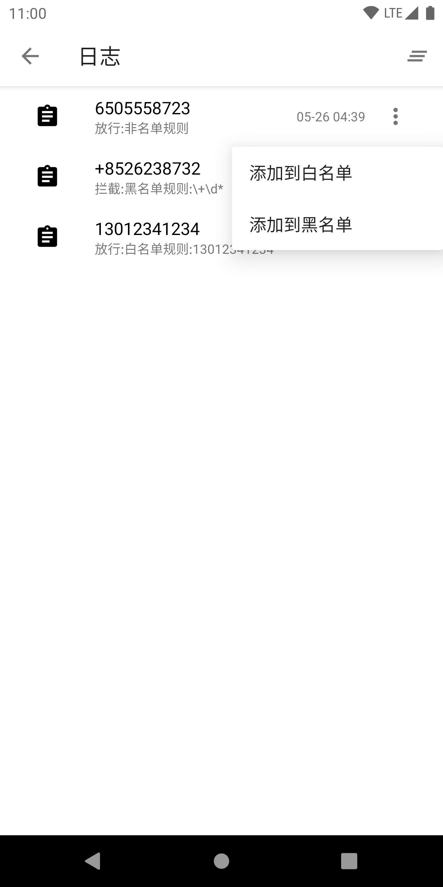

# 来电拦截

如果您对骚扰电话感到恼火，或者您想拦截来自任何人的电话，您只需将该号码添加到黑名单中，然后让该应用完成这项工作。

## 已实现

- 呼叫阻止
  阻止骚扰号码，不需要的呼叫和联系人，将其添加到来电黑名单。电话拦截助手将自动阻止来自骚扰电话，诈骗电话和自动语音呼叫。

- 来电黑/白名单
  您可以根据需要将任何不需要的号码添加到“黑名单”中，您可以随时查看被拦截的人。您可以选择多种拦截模式。
  
- 黑白名单支持正则表达式匹配

- 简易日志
  查看来电记录，并记录规则的拦截/放行情况。
  
- 号码增加一键添加黑/白名单
  快速实现号码添加进黑名单或白名单。
  
- 支持深色主题
  跟随系统深色主题切换应用内主题。
## TODO

- 来电识别/来电显示
  
- 智能通话记录

- 电话号码查询

- 未接来电提醒
  
- 限定时间内第三次来电不会拦截

- 归属地拦截功能

- 网络骚扰认证拦截

- 批量导入导出规则

- 离线数据库

- 显示哪张卡拦截标识

- 多语言

## 应用截图

### 应用首页

- 不支持的设备
  
  
- 未设置相关权限
  
  
- 未开启
  
  
- 运行中
  

### 设置权限

### 添加规则

### 日志

## 核心技术栈

### Kotlin语言
使用 Kotlin 更快地编写更出色的 Android 应用。Kotlin 是一种新型的静态类型编程语言，有超过 60% 的专业 Android 开发者在使用，它有助于提高工作效率、开发者满意度和代码安全性。

### MVVM
Model-View-ViewModel，View 指 Activity/Fragment，主要负责界面显示，不负责任何业务逻辑和数据处理。Model 指的是 Repository 包含的部分，主要负责数据获取，来组本地数据库或者远程服务器。ViewModel 主要负责业务逻辑和数据处理，本身不持有 View 层引用，通过 LiveData 向 View 层发送数据。Repository 统一了数据入口，不管来自数据库，还是服务器，统一打包给 ViewModel。

### 核心组件
- Lifecycles：它持有关于组件（如 Activity 或 Fragment）生命周期状态的信息，并且允许其他对象观察此状态
  
- ViewModel：以注重生命周期的方式管理界面相关的数据,为Activity 、Fragment存储数据，直到完全销毁；
  
- LiveData：不用手动控制生命周期，不用担心内存泄露，数据变化时会收到通知，与ViewModel的组合使用可以说是双剑合璧，而Lifecycles贯穿其中；
  
- ViewBinding：将布局组件与源数据绑定，使源数据变化的同时布局组件及时同步更新，与ViewModel、LiveData、Lifecycles搭配使用，能够碰撞出极致的MVVM火花
  
- Room：流畅地访问 SQLite 数据库；
